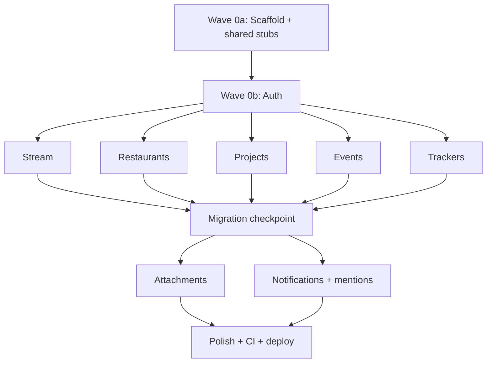

# Hearth multitask build plan

Implements the full v1 MVP defined in [docs/design/08_mvp.md](docs/design/08_mvp.md) (phases 0-7) across the stack in [docs/design/01_tech.md](docs/design/01_tech.md): Next.js App Router + TypeScript, SQLite via Drizzle + better-sqlite3, Lucia v3 auth, Tailwind v4 + Radix, Vitest.

## Multitask strategy (shared working tree)

The docs prescribe strict sequential phases. To parallelize safely in a single tree, this plan keeps the real dependency edges but overlaps independent feature work. Three rules make concurrent agents conflict-free:

1. Disjoint ownership. Each feature track owns its own files only: `app/(app)/<feature>/`, `src/lib/actions/<feature>.ts`, `src/db/schema/<feature>.ts`, `src/components/<Feature>*`, and `src/components/home/<Feature>Section.tsx`. No two tracks edit the same file.
2. Stable stub interfaces created up front. The foundation pre-creates every shared file so feature tracks never touch them: the home page with section slots, the full nav, the schema barrel, a no-op notification emitter, and placeholder `MentionTextarea` / `Attachments` components. Later tracks upgrade internals behind the same signatures.
3. Serialized migration generation. The Drizzle journal/snapshot is a shared resource, so `pnpm db:generate` is never run by two agents at once. Feature tracks author schema TS only; migrations are generated at a short checkpoint (one agent at a time).

Concurrency: Wave 0 is serial (one agent). The 5 feature tracks run in parallel. Attachments + notifications run as a parallel pair after features land. Polish is serial last.

## Wave 0a - Scaffold + shared stubs (serial, blocks everything)

Phase 0 of [docs/design/08_mvp.md](docs/design/08_mvp.md). One agent creates the toolchain AND the stable shared surfaces:

- Toolchain: `package.json` (pnpm, scripts `dev/build/start/test/lint/typecheck/db:migrate/db:generate`), `next.config.ts` (`output: "standalone"`), `tsconfig.json` (strict), Tailwind v4 in `app/globals.css` with tokens from [docs/design/05_styling.md](docs/design/05_styling.md), Vitest + ESLint + Prettier + commitlint, wire existing [lefthook.yml](lefthook.yml), `.env.example`, `Dockerfile` + `docker-compose.yml` + `scripts/docker-entrypoint.sh` per [docs/design/09_deploy.md](docs/design/09_deploy.md), `GET /api/health`.
- DB barrel + stubs: `src/db/index.ts` (`getDb()` singleton) and `src/db/schema/index.ts` re-exporting all 10 planned schema files (created as empty stubs: `stream.ts`, `restaurants.ts`, `projects.ts`, `trackers.ts`, `events.ts`, `mentions.ts`, `notifications.ts`, `attachments.ts` plus auth tables in Wave 0b). Feature tracks only fill in their own file.
- Shared UI shell so no track edits it later: `app/(app)/layout.tsx` with the complete nav (Home, Stream, Restaurants, Projects, Trackers, Events, Notifications bell + user menu), and `app/(app)/page.tsx` home that renders `<StreamSection/> <RestaurantsSection/> <ProjectsSection/> <TrackersSection/> <EventsSection/>` imported from `src/components/home/` (each shipped as a placeholder returning null).
- Stable side-effect interfaces: `src/lib/notifications/emit.ts` exporting log-only `emitHouseholdActivity()` and `emitMentions()` (Phase 2 permits log-only) so feature actions call the final signature today.
- Placeholder shared components upgraded later behind same props: `src/components/MentionTextarea.tsx` (plain textarea for now) and `src/components/Attachments.tsx` (renders nothing for now), plus base `src/components/ui/Button.tsx`.

Done when `pnpm install && pnpm dev` serves a page, `pnpm test` runs, `pnpm db:migrate` applies on a fresh DB, `docker compose up` passes health check.

## Wave 0b - Auth (serial, blocks all feature tracks)

Phase 1, per [docs/design/02_auth.md](docs/design/02_auth.md). Same agent or a handoff:

- Fill `src/db/schema/users.ts` + Lucia session table; generate the baseline migration.
- Lucia v3 + `@lucia-auth/adapter-drizzle`, Argon2id via `@node-rs/argon2` in `src/lib/auth/`; export `requireUser()` / `requireAdmin()` (every feature action depends on these).
- `middleware.ts` route protection, `/login` page + `login` action, `scripts/auth-bootstrap.ts` (`pnpm run auth:bootstrap`), `/settings` change-password, `/admin/users` CRUD.
- Test helpers `createTestUser`, `loginAs`, `createAdminSession`; tests for login/disabled-user/admin-guard/last-admin/bootstrap idempotency.

## Wave 1 - Feature tracks (5 agents in parallel)

Each track is self-contained per [docs/design/04_routes.md](docs/design/04_routes.md) + [docs/design/03_schema.md](docs/design/03_schema.md). For each: fill its `src/db/schema/<x>.ts`, write `src/lib/actions/<x>.ts` (each action calls `requireUser()`, validates with zod, writes via Drizzle, calls the emitter stub, `revalidatePath()`), build its routes + forms (forms use the shared `MentionTextarea`), replace its `src/components/home/<X>Section.tsx`, add co-located Vitest tests. Tracks do NOT run `pnpm db:generate` (deferred to checkpoint).

- Stream (Phase 2): `/stream` list + quick capture; actions `createEntry/updateEntry/togglePin/markDone`; home pinned+recent.
- Restaurants (Phase 3): `/restaurants` + `/restaurants/[id]`; `create/update/markVisited/setRating`; status/rating filters; home want-to-try preview.
- Projects (Phase 4): `/projects` + `/projects/[id]`; `create/update/setStatus`; home in-progress.
- Events (Phase 4): `/events` upcoming+past sorted by `starts_at`; `create/update/delete`; home next-14-days.
- Trackers (Phase 4): `/trackers` + `/trackers/[id]` history view; `createTracker/addEntry/updateTracker`; home latest/stale entry.

## Migration checkpoint (serial, ~1 short step)

After feature schemas land, one agent runs `pnpm db:generate` once, commits the migrations in `drizzle/`, and verifies `pnpm db:migrate` on a fresh DB. This is the single serialization point for the Drizzle journal.

## Wave 2 - Cross-cutting tracks (2 agents in parallel)

- Attachments (Phase 5, [docs/design/07_attachments.md](docs/design/07_attachments.md)): fill `src/db/schema/attachments.ts`, `src/lib/attachments/`, `POST /api/attachments` + `GET /api/attachments/[id]` (auth + mime/size validation, UUID filenames), and upgrade `src/components/Attachments.tsx` (thumbnail grid + Radix Dialog lightbox). Drop `<Attachments entityType entityId>` into the 5 detail pages. Owns: api routes, attachments lib/component, JSX insert points on detail pages.
- Notifications + mentions (Phase 6, [docs/design/06_notifications.md](docs/design/06_notifications.md)): fill `notifications.ts` + `mentions.ts` schema, implement real fan-out in `src/lib/notifications/emit.ts` (household-minus-actor) and `src/lib/mentions/parse.ts`, build `/notifications` page (mark read/all), nav unread badge, home "since last visit" block, and upgrade `MentionTextarea` with the `@` autocomplete Popover. Owns: notifications/mentions lib + page + the shared form component internals. Because feature actions already call the emitter signature, no feature action files need editing.

Light overlap note: both may touch feature form components (mentions) vs detail page JSX (attachments) - distinct regions, but run a typecheck after both merge.

## Wave 3 - Polish, CI, deploy (serial, last)

Phase 7: error boundaries + toast feedback, `useActionState` loading states, root `README.md` setup, CI at `.github/workflows/ci.yml` per [docs/design/10_ci.md](docs/design/10_ci.md) (lint/format:check/typecheck/test, in-memory DB), and a Docker smoke test (compose up -> health -> bootstrap -> login -> add stream note).

## Per-track done criteria

Every track ends green on `pnpm typecheck`, `pnpm lint`, and `pnpm test` for its scope before handoff, matching the acceptance checklists in [docs/design/08_mvp.md](docs/design/08_mvp.md). Do not commit `.env` or `data/`; commits only when explicitly requested.