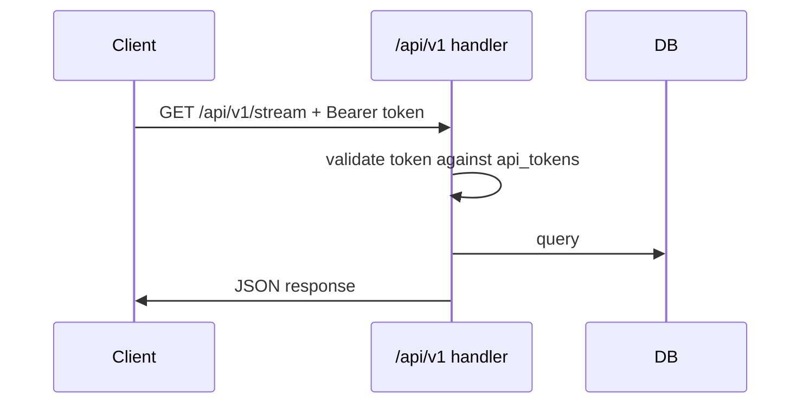
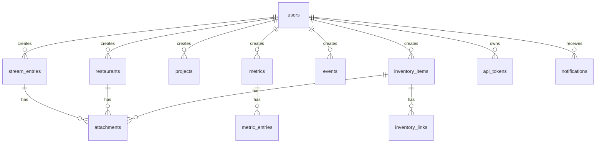
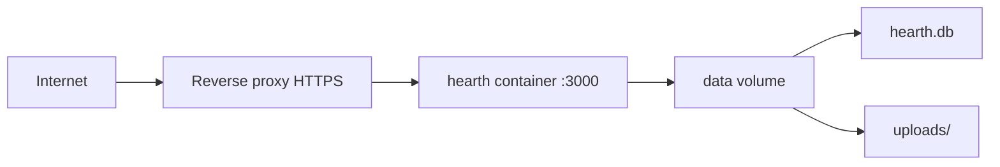

# Architecture overview

hearth is a self-hosted household coordination app: one Next.js process, one SQLite database, one household per instance.

## High-level architecture

```mermaid
flowchart TB
  subgraph clients [Clients]
    Browser[Web browser]
    Scripts[Scripts and integrations]
  end

  subgraph app [hearth instance]
    MW[Next.js middleware]
    Pages[App Router pages]
    Actions[Server actions]
    REST["REST API /api/v1"]
    API[Other API routes]
    Auth[Lucia auth + API tokens]
    DB[(SQLite hearth.db)]
    FS[data/uploads]
  end

  Browser --> MW
  Scripts --> REST
  MW --> Auth
  MW --> Pages
  Pages --> Actions
  Pages --> API
  REST --> Auth
  REST --> DB
  Actions --> DB
  Actions --> FS
  API --> DB
  API --> FS
  Auth --> DB
```



## Stack summary

| Layer | Technology |
| ----- | ---------- |
| Runtime | Node.js 22 |
| Framework | Next.js 15 (App Router) |
| Language | TypeScript |
| UI | React 19, Tailwind CSS v4, Radix UI |
| Charting | Recharts (metrics) |
| API | Route Handlers, Zod, zod-to-openapi, Scalar/Redoc |
| Database | SQLite via `better-sqlite3` |
| ORM | Drizzle |
| Auth | Lucia v3 + Argon2id; optional open web mode; API bearer tokens |
| Testing | Vitest |
| Containers | Docker + Compose |
| CI | GitHub Actions |

## Request flow

### Web UI (server actions)


### REST API (bearer token)



## Data model (summary)



Core entities: **users**, **stream entries**, **restaurants**, **projects**, **metrics** (+ entries), **events**, **inventory** (+ links, tags), **api tokens**, **notifications**, **mentions**, **attachments**.

Full schema: [Data Model](../design/03_schema.md)

## Repository layout

```
app/                    # Next.js routes and layouts
  (app)/                # authenticated pages
  login/                # public login
  api/
    v1/                 # REST API
    openapi.json/       # OpenAPI spec
    docs/               # interactive API docs
    attachments/        # upload + serve
    inventory/          # import + export
src/
  db/                   # Drizzle client + schema
  lib/
    auth/               # Lucia, sessions, passwords, tokens
    api/                # REST handlers, Zod schemas, OpenAPI
    actions/            # server actions by domain
    notifications/      # activity fan-out
    mentions/           # @-mention parsing
    attachments/        # upload + serve
  components/           # UI components
drizzle/                # SQL migrations
data/                   # gitignored: DB + uploads
docs/                   # this documentation site
```

## Key design decisions

| Decision | Rationale |
| -------- | --------- |
| One household per instance | No multi-tenant complexity; instance _is_ the household |
| SQLite embedded | Zero-config, file-backed, fits single-instance deploy |
| Server actions for web mutations | Colocated with UI; progressive enhancement |
| REST API as additional surface | Scripts, integrations, bulk ops — `/api/v1/*` with OpenAPI |
| Bearer tokens always for REST | Independent of web auth mode (`required` or `open`) |
| API routes for uploads + bulk | Multipart/binary awkward in server actions |
| Configurable web auth mode | `required` (default) or `open` for trusted networks |
| Local file storage | Matches embedded DB; simple Docker volume backup |
| Show what exists first | List pages lead with content; capture is secondary |

## Cross-cutting concerns

### Authentication

Username/password with server-side sessions in SQLite. Middleware protects routes in `required` mode; `open` mode skips the gate and attributes writes to a shared user. Admin routes always require a logged-in admin. REST API uses bearer tokens from `api_tokens`.

Details: [Authentication](../design/02_auth.md)

### Notifications

Household activity fan-out to all members (except actor). @-mentions always notify the mentioned user.

Details: [Notifications](../design/06_notifications.md)

### Attachments

Files on disk under `data/uploads/`; metadata in SQLite. Images for most entities; inventory also accepts PDF documents. Authenticated serve only.

Details: [Attachments](../design/07_attachments.md)

## Deployment topology



Single writer. No load balancer with multiple replicas.

Details: [Deployment Design](../design/09_deploy.md)

## Design documentation

Detailed design references (source of truth for implementation):

| Doc | Topic |
| --- | ----- |
| [Product Vision](../design/00_init.md) | Features, principles, scope |
| [Tech Choices](../design/01_tech.md) | Stack decisions |
| [Authentication](../design/02_auth.md) | Users, sessions, auth modes, API tokens |
| [Data Model](../design/03_schema.md) | Tables, enums, relationships |
| [Routes & Structure](../design/04_routes.md) | App Router layout, REST, actions |
| [Styling](../design/05_styling.md) | Tailwind, Radix, charts, layout patterns |
| [Notifications](../design/06_notifications.md) | Fan-out, mentions |
| [Attachments](../design/07_attachments.md) | Upload flow, per-entity mime policy |
| [MVP Phases](../design/08_mvp.md) | Build phases 0–10 |
| [Deployment Design](../design/09_deploy.md) | Docker, env, backup |
| [CI/CD](../design/10_ci.md) | GitHub Actions |

## Contributing

See [Contributing](../contributing.md) for development setup and conventions.
