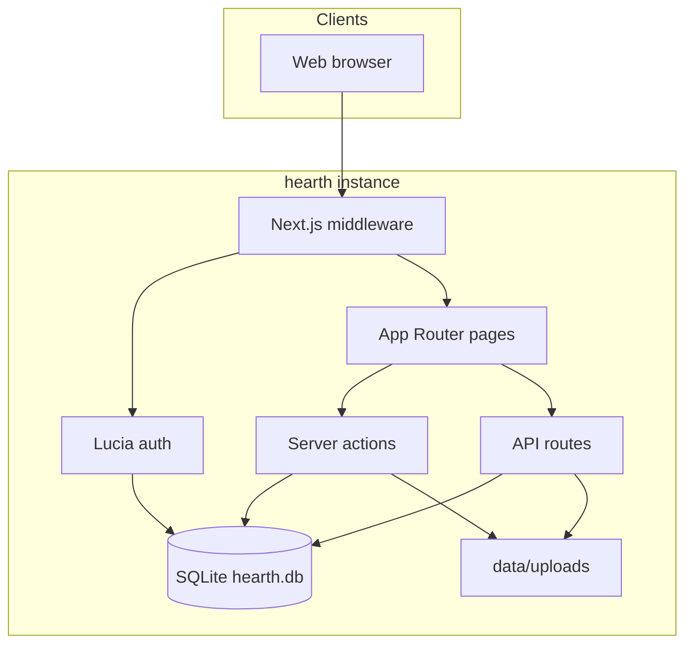
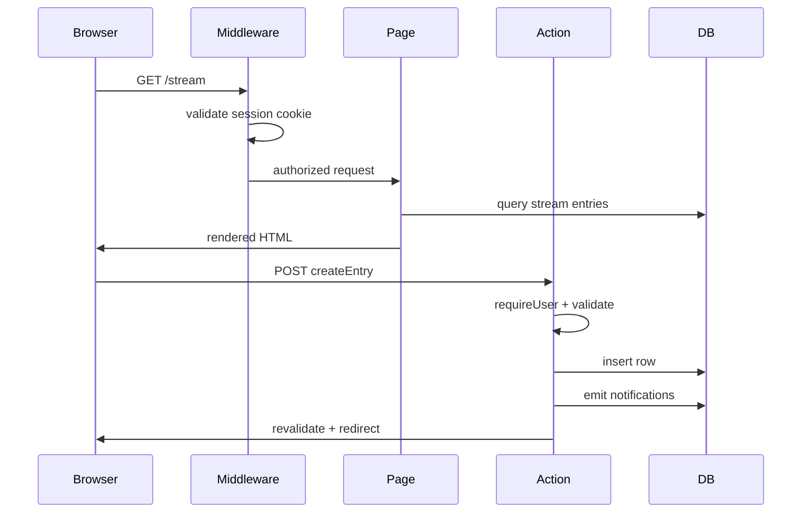
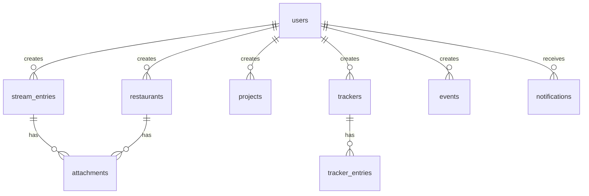
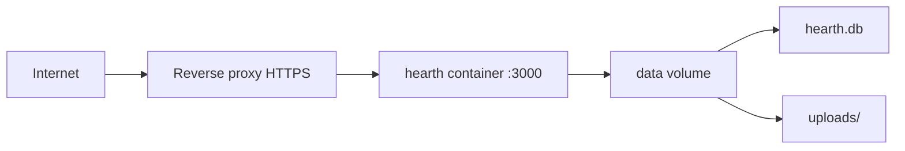

# Architecture overview

hearth is a self-hosted household coordination app: one Next.js process, one SQLite database, one household per instance.

## High-level architecture



## Stack summary

| Layer | Technology |
| ----- | ---------- |
| Runtime | Node.js 22 |
| Framework | Next.js 15 (App Router) |
| Language | TypeScript |
| UI | React 19, Tailwind CSS v4, Radix UI |
| Database | SQLite via `better-sqlite3` |
| ORM | Drizzle |
| Auth | Lucia v3 + Argon2id |
| Testing | Vitest |
| Containers | Docker + Compose |
| CI | GitHub Actions |

## Request flow



## Data model (summary)



Core entities: **users**, **stream entries**, **restaurants**, **projects**, **trackers** (+ entries), **events**, **notifications**, **mentions**, **attachments**.

Full schema: [Data Model](../design/03_schema.md)

## Repository layout

```
app/                    # Next.js routes and layouts
  (app)/                # authenticated pages
  login/                # public login
  api/                  # health + attachments only
src/
  db/                   # Drizzle client + schema
  lib/
    auth/               # Lucia, sessions, passwords
    actions/            # server actions by domain
    notifications/      # activity fan-out
    mentions/           # @-mention parsing
    attachments/        # upload + serve
  components/           # UI components
drizzle/                # SQL migrations
data/                   # gitignored: DB + uploads
docs/                   # this documentation site
```

## Key design decisions

| Decision | Rationale |
| -------- | --------- |
| One household per instance | No multi-tenant complexity; instance _is_ the household |
| SQLite embedded | Zero-config, file-backed, fits single-instance deploy |
| Server actions for mutations | Colocated with UI; no REST CRUD APIs for features |
| API routes for uploads only | Multipart/binary awkward in server actions |
| Admin-managed users | No OAuth or email infrastructure needed |
| Local photo storage | Matches embedded DB; simple Docker volume backup |

## Cross-cutting concerns

### Authentication

Username/password with server-side sessions in SQLite. Middleware protects routes; server actions call `requireUser()` / `requireAdmin()`.

Details: [Authentication](../design/02_auth.md)

### Notifications

Household activity fan-out to all members (except actor). @-mentions always notify the mentioned user.

Details: [Notifications](../design/06_notifications.md)

### Attachments

Photos on disk under `data/uploads/`; metadata in SQLite. Authenticated serve only.

Details: [Attachments](../design/07_attachments.md)

## Deployment topology



Single writer. No load balancer with multiple replicas.

Details: [Deployment Design](../design/09_deploy.md)

## Design documentation

Detailed design references (source of truth for implementation):

| Doc | Topic |
| --- | ----- |
| [Product Vision](../design/00_init.md) | Features, principles, scope |
| [Tech Choices](../design/01_tech.md) | Stack decisions |
| [Authentication](../design/02_auth.md) | Users, sessions, bootstrap |
| [Data Model](../design/03_schema.md) | Tables, enums, relationships |
| [Routes & Structure](../design/04_routes.md) | App Router layout, actions |
| [Styling](../design/05_styling.md) | Tailwind, Radix, design tokens |
| [Notifications](../design/06_notifications.md) | Fan-out, mentions |
| [Attachments](../design/07_attachments.md) | Upload flow, storage |
| [MVP Phases](../design/08_mvp.md) | Build phases 0–7 |
| [Deployment Design](../design/09_deploy.md) | Docker, env, backup |
| [CI/CD](../design/10_ci.md) | GitHub Actions |

## Contributing

See [Contributing](../contributing.md) for development setup and conventions.
