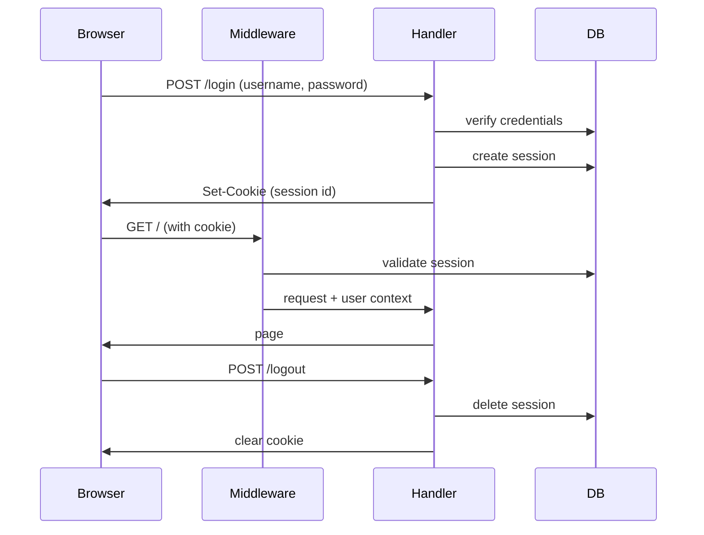

# Authentication & Users

Structured reference for agents and contributors. Product context lives in `00_init.md` (Users & access); this doc covers roles, flows, and implementation conventions.

**Model:** one household per instance. Self-managed username/password auth — no OAuth, no self-service signup, no external identity provider. Web access is configurable (`required` by default, or `open` for a trusted network), and a separate **API token** scheme guards the programmatic REST API.

---

## Roles

| Role       | Capabilities                                                                                                    |
| ---------- | --------------------------------------------------------------------------------------------------------------- |
| **member** | Log in, read and write all household data, change own password, view notification stream                        |
| **admin**  | Everything a member can do, plus create/disable users, reset any user's password, promote another user to admin |

There is no read-only or guest role in v1. Every authenticated user has full access to shared data.

**Invariant:** at least one active admin must exist at all times. The admin UI must block disabling or demoting the last admin.

---

## Authentication modes

The **web UI** access model is configurable per instance via the `AUTH_MODE` environment variable. The **REST API is unaffected** — it always requires a token (see [API tokens](#api-tokens)).

| Mode                 | Web login gate                          | Write attribution                                         | Admin routes                       |
| -------------------- | --------------------------------------- | --------------------------------------------------------- | ---------------------------------- |
| `required` (default) | Enforced — unauthenticated → `/login`   | The logged-in user                                        | Require session + `role = admin`   |
| `open`               | Skipped for app pages                   | A single shared identity (`OPEN_MODE_USERNAME`)           | Still require a logged-in admin    |

**`required` (default).** Behaves exactly as the rest of this doc describes: middleware validates a session for every protected route and redirects to `/login?returnTo=...` when missing.

**`open`.** Intended for a hearth that lives behind a trusted private network (home LAN, VPN, reverse proxy with its own gate). The middleware lets requests through to app pages without a session and resolves the current actor to the user named by `OPEN_MODE_USERNAME` (which must exist and be active). All household reads and writes are attributed to that shared identity, so the notification stream and `created_by_user_id` columns still resolve to a real user row.

**Admin is never open.** Even in `open` mode, `/admin/**` requires a real logged-in admin session. Open mode skips the gate for everyday app pages only; an admin must explicitly log in to manage users or API tokens. `@-mentions` and per-user notification read state are degenerate in open mode (one shared identity) but the schema and flows are unchanged.

Mode is read once at startup. Changing it requires an env change + restart; it is not a per-request toggle.

---

## User lifecycle

| Action                | Who          | Notes                                                              |
| --------------------- | ------------ | ------------------------------------------------------------------ |
| Bootstrap first admin | Deploy / CLI | Created once when the instance has no users (see Bootstrap)        |
| Create user           | Admin        | Username + initial password (+ optional display name)              |
| Log in                | User         | Username + password → session cookie                               |
| Change own password   | User         | Requires current password                                          |
| Reset password        | Admin        | Sets a new password for any user; no email flow                    |
| Disable user          | Admin        | Soft-disable: user cannot log in; historical attribution preserved |
| Re-enable user        | Admin        | Restores login access                                              |
| Promote to admin      | Admin        | Idempotent; cannot demote self if last admin                       |

Usernames are unique within the instance. Display names are optional and used for @-mentions and activity attribution; default to username when unset.

---

## Passwords

| Field           | Value                                                                                                                                                                                          |
| --------------- | ---------------------------------------------------------------------------------------------------------------------------------------------------------------------------------------------- |
| **Hashing**     | Argon2id via `@node-rs/argon2`                                                                                                                                                                 |
| **Role**        | One-way password storage                                                                                                                                                                       |
| **Rationale**   | Modern default for new applications; resistant to GPU cracking. Native bindings via `@node-rs/*` perform well in Node without shipping a full compiler toolchain.                              |
| **Conventions** | Never store or log plaintext passwords. Hash on write (create, reset, change-password); verify on login. Tune Argon2 params via env or constants in one module — do not scatter magic numbers. |
| **References**  | https://github.com/napi-rs/node-rs · https://cheatsheetseries.owasp.org/cheatsheets/Password_Storage_Cheat_Sheet.html                                                                          |

**Policy (v1):**

- Minimum length: 8 characters
- No complexity rules (length is enough for a trusted household)
- No password reset email — admin resets manually
- No "forgot password" self-service flow

---

## Sessions

| Field           | Value                                                                                                                                                                                                                                               |
| --------------- | --------------------------------------------------------------------------------------------------------------------------------------------------------------------------------------------------------------------------------------------------- |
| **Choice**      | Server-side sessions in SQLite + httpOnly cookie                                                                                                                                                                                                    |
| **Role**        | Authenticate requests after login                                                                                                                                                                                                                   |
| **Rationale**   | Fits the single-instance, embedded-SQLite stack. Sessions can be revoked immediately (disable user, logout everywhere). No JWT secret rotation or stateless tradeoffs needed at this scale.                                                         |
| **Library**     | Lucia v3 with `@lucia-auth/adapter-drizzle`                                                                                                                                                                                                         |
| **Conventions** | Session ID in an httpOnly, `Secure` (production), `SameSite=Lax` cookie. Validate session in Next.js middleware for protected routes and in server actions / route handlers. Invalidate all sessions for a user on disable or admin password reset. |
| **References**  | https://lucia-auth.com · https://nextjs.org/docs/app/building-your-application/routing/middleware                                                                                                                                                   |

### Session flow



---

## Route protection

| Surface                                        | `required` mode                                                  | `open` mode                                                      |
| ---------------------------------------------- | ---------------------------------------------------------------- | ---------------------------------------------------------------- |
| `/login`                                       | Public; redirect to `/` if already authenticated                 | Same                                                             |
| App pages (`/`, feature routes, notifications) | Require valid session → else `/login?returnTo=...`              | No session required; actor = `OPEN_MODE_USERNAME` user           |
| Admin pages (`/admin/users`, `/admin/api-tokens`) | Require session + `role = admin`                              | Same — admin must log in                                         |
| `/api/v1/*`                                    | Bearer token required (see [API tokens](#api-tokens))            | Same — token required regardless of web mode                     |
| Other API routes (`/api/attachments`, etc.)    | Session or bearer token                                          | Session or bearer token; open mode uses shared identity for session-less web uploads |
| Server actions                                 | `requireUser()` / `requireAdmin()` in handler                    | `requireUser()` resolves shared identity in open mode            |

Never rely on client-side checks alone.

---

## API tokens

Machine-to-machine auth for the programmatic REST API (`/api/v1/*`). Tokens are **always required** for REST — independent of `AUTH_MODE`.

| Field           | Value                                                                                                      |
| --------------- | ---------------------------------------------------------------------------------------------------------- |
| **Storage**     | `api_tokens` table — hashed token value, never plaintext after creation                                     |
| **Format**      | `hearth_pat_<random>` prefix shown at creation; only the hash is stored                                    |
| **Attribution** | Each token is tied to a `user_id`; API writes attribute to that user                                       |
| **Creation**    | Admin UI at `/admin/api-tokens` or CLI script `pnpm run auth:create-token`                                 |
| **Revocation**  | Set `revoked_at`; revoked tokens fail immediately                                                          |
| **Header**      | `Authorization: Bearer <token>`                                                                            |

### `api_tokens` schema (conceptual)

| Column         | Type             | Notes                              |
| -------------- | ---------------- | ---------------------------------- |
| `id`           | text PK          |                                    |
| `user_id`      | text FK → users  | Attribution target                 |
| `name`         | text NOT NULL    | Human label — "home automation"    |
| `prefix`       | text NOT NULL    | First chars for identification     |
| `token_hash`   | text NOT NULL    | Argon2id or SHA-256 of full token  |
| `last_used_at` | integer NULL     | ms; updated on successful auth     |
| `revoked_at`   | integer NULL     | ms; NULL = active                  |
| `created_at`   | integer NOT NULL |                                    |

List view shows name, prefix, user, last used, created — never the full secret.

---

## Admin UI

Minimal administration under `/admin` (admin role only):

**Users** (`/admin/users`):

- List users: username, display name, role, active/disabled, last seen (`last_seen_at`, if tracked)
- Create user: username, initial password, optional display name, role (default member)
- Reset password: set new password for selected user
- Disable / re-enable toggle
- Promote to admin

**API tokens** (`/admin/api-tokens`):

- List tokens: name, prefix, owning user, last used, revoked status
- Create token: name + owning user → show full token **once** for copy
- Revoke token

No bulk import, no invitation emails. The admin copies credentials out of band (text, in person, etc.).

---

## Bootstrap

On first run, the instance has no users. The first admin is created outside the web UI:

| Field         | Value                                                                   |
| ------------- | ----------------------------------------------------------------------- |
| **Mechanism** | CLI script: `pnpm run auth:bootstrap`                                   |
| **Input**     | Username + password via prompts, or env vars for non-interactive deploy |
| **Guard**     | Script refuses to run if any user already exists                        |

Env vars for non-interactive bootstrap (document in `.env.example`):

```bash
HEARTH_BOOTSTRAP_USERNAME=
HEARTH_BOOTSTRAP_PASSWORD=
HEARTH_BOOTSTRAP_DISPLAY_NAME=  # optional
```

After bootstrap, all further user management goes through the admin UI.

---

## Database schema (conceptual)

Tables managed via Drizzle migrations alongside the rest of the app schema:

```yaml
users:
  id: uuid or text primary key
  username: text unique not null
  display_name: text nullable
  password_hash: text not null
  role: enum [member, admin] default member
  disabled_at: timestamp nullable
  created_at: timestamp not null
  updated_at: timestamp not null

sessions:
  id: text primary key
  user_id: foreign key -> users.id
  expires_at: timestamp not null
  # lucia may add additional columns per adapter docs

api_tokens:
  id: text primary key
  user_id: foreign key -> users.id # identity the token acts as
  name: text not null # human label, e.g. "home-assistant"
  prefix: text not null unique # short public lookup id
  token_hash: text not null # hash of full secret; never plaintext
  last_used_at: timestamp nullable
  revoked_at: timestamp nullable # null = active
  created_at: timestamp not null
```

Lucia's Drizzle adapter defines exact session table shape — follow upstream schema when implementing. Full `api_tokens` columns and indexes live in `03_schema.md`.

**Attribution:** content tables (projects, restaurants, etc.) store `created_by_user_id` / `updated_by_user_id` for notifications and @-mentions. Use display name at render time, not denormalized strings.

---

## Environment variables

```yaml
auth:
  mode: AUTH_MODE # required (default) | open
  open_mode_username: OPEN_MODE_USERNAME # required when AUTH_MODE=open; must match an active user
  session_cookie_name: hearth_session # default; override if needed
  session_ttl_days: 30 # sliding or absolute — pick one in implementation
  bootstrap:
    username: HEARTH_BOOTSTRAP_USERNAME
    password: HEARTH_BOOTSTRAP_PASSWORD
    display_name: HEARTH_BOOTSTRAP_DISPLAY_NAME
  secrets:
    # Reserved / unused — Lucia uses opaque DB session IDs stored in SQLite, not signed cookies.
    session_secret: SESSION_SECRET
```

| Variable              | Required              | Default     | Purpose                                      |
| --------------------- | --------------------- | ----------- | -------------------------------------------- |
| `AUTH_MODE`           | no                    | `required`  | Web access: `required` \| `open`             |
| `OPEN_MODE_USERNAME`  | when `AUTH_MODE=open` | —           | Username of shared identity for open mode    |

`SESSION_SECRET` is listed in `.env.example` for backward compatibility but is **not read** by the application. It may be removed in a future release.

---

## Security conventions

- Compare passwords with constant-time verify provided by the Argon2 library
- Rate-limit login attempts per IP + username (simple in-memory or SQLite counter for v1)
- Regenerate session ID on login (session fixation mitigation — follow Lucia defaults)
- Invalidate all sessions when a user is disabled or admin-resets their password
- Never expose password hashes, session IDs, or bootstrap secrets in API responses or logs
- Admin actions (create user, reset password, disable) should append to the notification stream as household-visible audit events where appropriate

---

## Testing

- Use in-memory SQLite (`DATABASE_URL=file::memory:?cache=shared`) per `01_tech.md`
- Test helpers: `createTestUser`, `loginAs`, `createAdminSession` for Vitest integration tests
- Cover: login success/failure, disabled user rejection, admin-only routes, last-admin guard, bootstrap idempotency

---

## Auth summary (machine-readable)

```yaml
auth:
  model: self-managed
  household_per_instance: 1
  provider: none # no OAuth
  web_mode:
    env: AUTH_MODE
    values: [required, open]
    default: required
    open_identity: OPEN_MODE_USERNAME
  api_tokens:
    table: api_tokens
    header: "Authorization: Bearer <token>"
    always_required_for: /api/v1/*
    admin_route: /admin/api-tokens
  password_hash: argon2id
  password_hash_lib: "@node-rs/argon2"
  session: server-side
  session_store: sqlite
  session_lib: lucia
  session_adapter: "@lucia-auth/adapter-drizzle"
  roles: [member, admin]
  bootstrap: cli
  self_service_signup: false
  password_reset_email: false
  routes:
    public: [/login, /api/health, /api/openapi.json, /api/docs]
    protected: [/** except /login and /api/v1/*]
    admin: [/admin/**]
    api_v1: bearer_token_required
```

---

## Out of scope (for now)

- OAuth / social login (Google, Apple, etc.)
- Magic links or email-based login
- Two-factor authentication (TOTP, WebAuthn)
- Self-service registration or "forgot password"
- Multiple households or cross-instance federation
- Fine-grained permissions beyond admin vs member
- Scoped API tokens (per-resource permissions) — v1 tokens grant full household access as their user
