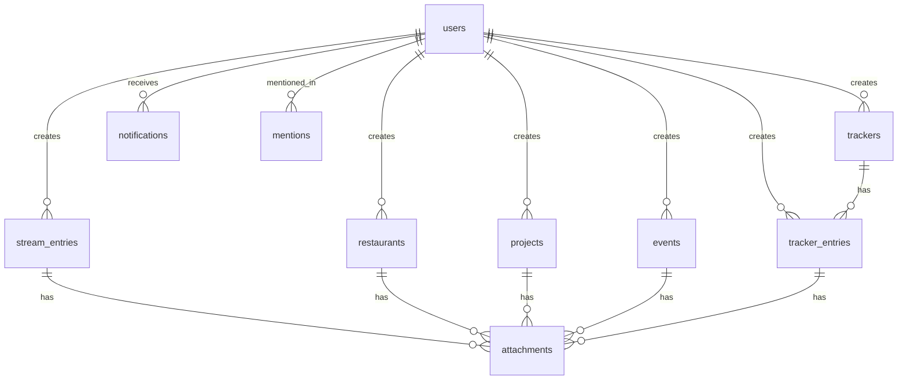

# Data Model

Structured reference for agents and contributors. Drizzle schema and migrations in `src/db/schema/` (see `04_routes.md`). Auth tables summarized here; full auth rules in `02_auth.md`.

**Conventions:**

- Primary keys: `text` UUIDs (`crypto.randomUUID()`)
- Timestamps: `integer` Unix ms (`created_at`, `updated_at`) — consistent SQLite/Drizzle pattern
- Attribution: `created_by_user_id` and `updated_by_user_id` on mutable entities
- Soft-disable users only (`disabled_at`); content is never hard-deleted in v1

---

## Enums

| Enum                | Values                                                                       | Used by                              |
| ------------------- | ---------------------------------------------------------------------------- | ------------------------------------ |
| `user_role`         | `member`, `admin`                                                            | `users.role`                         |
| `restaurant_status` | `want_to_try`, `visited`                                                     | `restaurants.status`                 |
| `project_status`    | `idea`, `in_progress`, `done`                                                | `projects.status`                    |
| `entity_type`       | `stream_entry`, `restaurant`, `project`, `tracker`, `tracker_entry`, `event` | attachments, mentions, notifications |
| `notification_type` | see `06_notifications.md`                                                    | `notifications.type`                 |

---

## Auth tables

Defined in detail in `02_auth.md`. Included here for ERD completeness.

### `users`

| Column          | Type                 | Notes                                   |
| --------------- | -------------------- | --------------------------------------- |
| `id`            | text PK              |                                         |
| `username`      | text UNIQUE NOT NULL | login identifier                        |
| `display_name`  | text NULL            | @-mention label; falls back to username |
| `password_hash` | text NOT NULL        | Argon2id                                |
| `role`          | text NOT NULL        | `member` \| `admin`                     |
| `disabled_at`   | integer NULL         | ms; NULL = active                       |
| `last_seen_at`  | integer NULL         | ms; updated on authenticated page load  |
| `created_at`    | integer NOT NULL     |                                         |
| `updated_at`    | integer NOT NULL     |                                         |

### `sessions`

Managed by Lucia + `@lucia-auth/adapter-drizzle`. Follow upstream adapter schema at implementation time.

---

## Stream

### `stream_entries`

| Column               | Type             | Notes                                         |
| -------------------- | ---------------- | --------------------------------------------- |
| `id`                 | text PK          |                                               |
| `body`               | text NOT NULL    | markdown-lite plain text; @-mentions embedded |
| `is_pinned`          | integer NOT NULL | 0/1 boolean                                   |
| `done_at`            | integer NULL     | ms; NULL = open                               |
| `rough_when`         | text NULL        | freeform ("this week", "before trip")         |
| `created_by_user_id` | text FK → users  |                                               |
| `updated_by_user_id` | text FK → users  |                                               |
| `created_at`         | integer NOT NULL |                                               |
| `updated_at`         | integer NOT NULL |                                               |

**Indexes:** `(created_at DESC)`, `(is_pinned, created_at DESC)`, `(done_at)` where open items matter.

---

## Restaurants

### `restaurants`

| Column               | Type             | Notes                             |
| -------------------- | ---------------- | --------------------------------- |
| `id`                 | text PK          |                                   |
| `name`               | text NOT NULL    |                                   |
| `neighborhood`       | text NULL        | v1 location field                 |
| `address`            | text NULL        | optional freeform address         |
| `notes`              | text NULL        | why we want to go / general notes |
| `status`             | text NOT NULL    | `want_to_try` \| `visited`        |
| `rating`             | integer NULL     | 1–5; set when visited             |
| `visit_note`         | text NULL        | post-visit review                 |
| `visited_at`         | integer NULL     | ms                                |
| `created_by_user_id` | text FK → users  | who suggested                     |
| `updated_by_user_id` | text FK → users  |                                   |
| `created_at`         | integer NOT NULL |                                   |
| `updated_at`         | integer NOT NULL |                                   |

**Indexes:** `(status, created_at DESC)`, `(rating)` for visited.

**Later:** `lat`, `lng`, `google_place_id` columns — not in v1 migrations.

---

## Projects

### `projects`

| Column               | Type             | Notes                             |
| -------------------- | ---------------- | --------------------------------- |
| `id`                 | text PK          |                                   |
| `title`              | text NOT NULL    |                                   |
| `description`        | text NULL        |                                   |
| `status`             | text NOT NULL    | `idea` \| `in_progress` \| `done` |
| `created_by_user_id` | text FK → users  |                                   |
| `updated_by_user_id` | text FK → users  |                                   |
| `created_at`         | integer NOT NULL |                                   |
| `updated_at`         | integer NOT NULL |                                   |

**Indexes:** `(status, updated_at DESC)`.

---

## Trackers

### `trackers`

| Column               | Type             | Notes                           |
| -------------------- | ---------------- | ------------------------------- |
| `id`                 | text PK          |                                 |
| `name`               | text NOT NULL    | e.g. "Flora's weight"           |
| `unit`               | text NULL        | e.g. "lbs", "°F" — display only |
| `created_by_user_id` | text FK → users  |                                 |
| `created_at`         | integer NOT NULL |                                 |
| `updated_at`         | integer NOT NULL |                                 |

### `tracker_entries`

| Column               | Type               | Notes                            |
| -------------------- | ------------------ | -------------------------------- |
| `id`                 | text PK            |                                  |
| `tracker_id`         | text FK → trackers | ON DELETE CASCADE                |
| `value`              | text NOT NULL      | numeric or text stored as string |
| `note`               | text NULL          |                                  |
| `recorded_at`        | integer NOT NULL   | ms — when measurement applies    |
| `created_by_user_id` | text FK → users    |                                  |
| `created_at`         | integer NOT NULL   |                                  |

**Indexes:** `(tracker_id, recorded_at DESC)`.

---

## Events

### `events`

| Column               | Type             | Notes                   |
| -------------------- | ---------------- | ----------------------- |
| `id`                 | text PK          |                         |
| `title`              | text NOT NULL    |                         |
| `starts_at`          | integer NOT NULL | ms — date/time of event |
| `location`           | text NULL        |                         |
| `link`               | text NULL        | URL                     |
| `note`               | text NULL        |                         |
| `created_by_user_id` | text FK → users  |                         |
| `updated_by_user_id` | text FK → users  |                         |
| `created_at`         | integer NOT NULL |                         |
| `updated_at`         | integer NOT NULL |                         |

**Indexes:** `(starts_at ASC)` for upcoming lists.

Past events remain in DB; UI filters `starts_at >= now` on home summary. Full list view can toggle archived/past.

---

## Mentions

Parsed @-references stored for notification delivery and autocomplete. See `06_notifications.md`.

### `mentions`

| Column               | Type             | Notes                        |
| -------------------- | ---------------- | ---------------------------- |
| `id`                 | text PK          |                              |
| `mentioned_user_id`  | text FK → users  |                              |
| `entity_type`        | text NOT NULL    | `entity_type` enum           |
| `entity_id`          | text NOT NULL    | polymorphic FK               |
| `created_by_user_id` | text FK → users  | author who typed the mention |
| `created_at`         | integer NOT NULL |                              |

**Indexes:** `(mentioned_user_id, created_at DESC)`, `(entity_type, entity_id)`.

Unique constraint optional: one mention row per (user, entity) if re-edits replace mentions.

---

## Notifications

Per-user activity feed. Detail in `06_notifications.md`.

### `notifications`

| Column              | Type                 | Notes                            |
| ------------------- | -------------------- | -------------------------------- |
| `id`                | text PK              |                                  |
| `recipient_user_id` | text FK → users      | who sees this in their stream    |
| `actor_user_id`     | text FK → users NULL | NULL for system/bootstrap events |
| `type`              | text NOT NULL        | `notification_type` enum         |
| `entity_type`       | text NULL            | linked content                   |
| `entity_id`         | text NULL            |                                  |
| `summary`           | text NOT NULL        | pre-rendered line for feed UI    |
| `read_at`           | integer NULL         | ms; NULL = unread                |
| `created_at`        | integer NOT NULL     |                                  |

**Indexes:** `(recipient_user_id, created_at DESC)`, `(recipient_user_id, read_at)`.

**Fan-out:** most events create one row per household member except the actor (who already knows). @-mention events always include the mentioned user. See `06_notifications.md`.

---

## Attachments

Metadata in SQLite; bytes on disk. Detail in `07_attachments.md`.

### `attachments`

| Column               | Type             | Notes                               |
| -------------------- | ---------------- | ----------------------------------- |
| `id`                 | text PK          |                                     |
| `entity_type`        | text NOT NULL    |                                     |
| `entity_id`          | text NOT NULL    |                                     |
| `filename`           | text NOT NULL    | original name                       |
| `mime_type`          | text NOT NULL    |                                     |
| `size_bytes`         | integer NOT NULL |                                     |
| `storage_path`       | text NOT NULL    | relative path under `data/uploads/` |
| `created_by_user_id` | text FK → users  |                                     |
| `created_at`         | integer NOT NULL |                                     |

**Indexes:** `(entity_type, entity_id)`.

---

## Entity relationship (overview)



---

## Drizzle layout

```
src/db/
  index.ts           # getDb(), singleton for better-sqlite3
  schema/
    users.ts
    sessions.ts      # Lucia adapter tables
    stream.ts
    restaurants.ts
    projects.ts
    trackers.ts
    events.ts
    mentions.ts
    notifications.ts
    attachments.ts
    index.ts         # re-export all tables
  migrations/        # generated by drizzle-kit → copied to drizzle/ at root
```

Run migrations via `pnpm db:migrate`. Seed data optional for dev only — not committed.

---

## Schema summary (machine-readable)

```yaml
schema:
  orm: drizzle
  migrations_dir: drizzle
  id_type: text_uuid
  timestamp_type: integer_ms
  tables:
    auth: [users, sessions]
    features:
      stream: [stream_entries]
      restaurants: [restaurants]
      projects: [projects]
      trackers: [trackers, tracker_entries]
      events: [events]
    cross_cutting:
      - mentions
      - notifications
      - attachments
  enums:
    user_role: [member, admin]
    restaurant_status: [want_to_try, visited]
    project_status: [idea, in_progress, done]
    entity_type: [stream_entry, restaurant, project, tracker, tracker_entry, event]
```
