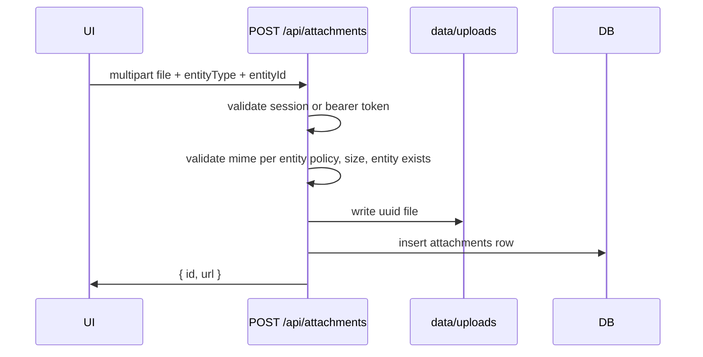

# Attachments (Photos & Documents)

Structured reference for agents and contributors. Product behavior in `00_init.md` (Attachments); schema in `03_schema.md`.

**Model:** files on local disk; metadata in SQLite. No S3 or external hosting in v1. Most entities accept **images only**; inventory additionally accepts **documents** (PDFs, manuals, receipts).

---

## Storage

| Field           | Value                                                                                                                                                                        |
| --------------- | ---------------------------------------------------------------------------------------------------------------------------------------------------------------------------- |
| **Choice**      | Local filesystem under `data/uploads/`                                                                                                                                       |
| **Role**        | Byte storage for photos and documents                                                                                                                                        |
| **Rationale**   | Matches single-instance SQLite deployment. Simple Docker volume mount. No extra service cost.                                                                                |
| **Conventions** | Gitignore entire `data/` directory (already in `.gitignore`). Paths stored in DB are relative to project root: `uploads/{uuid}.{ext}`. Never serve files without auth check. |
| **References**  | `09_deploy.md` for volume mounts                                                                                                                                             |

Directory layout:

```
data/
  hearth.db
  uploads/
    ab12cd34-....jpg
    ef56gh78-....pdf
```

---

## Per-entity mime policy

| entity_type     | Images | Documents (PDF) | Notes                                |
| --------------- | ------ | --------------- | ------------------------------------ |
| `stream_entry`  | Yes    | No              | Photos only                          |
| `restaurant`    | Yes    | No              | Menu pics, visit photos              |
| `project`       | Yes    | No              | Before/after, progress photos        |
| `metric_entry`  | Yes    | No              | Scale reading, condition photo       |
| `inventory_item`| Yes    | Yes             | Photos + manuals, receipts, warranties |

### Allowed mime types

**Images (all supported entities):**

| Mime type      | Extensions   |
| -------------- | ------------ |
| `image/jpeg`   | `.jpg`, `.jpeg` |
| `image/png`    | `.png`       |
| `image/webp`   | `.webp`      |
| `image/gif`    | `.gif`       |

**Documents (inventory only):**

| Mime type       | Extensions |
| --------------- | ---------- |
| `application/pdf` | `.pdf`   |

| Rule           | Value                                                |
| -------------- | ---------------------------------------------------- |
| Max size       | 10 MB per file (images); 25 MB per file (documents)  |
| Max per entity | 10 files (images + documents combined for inventory) |
| Extensions     | Derived from mime; reject mismatch                     |

Validate mime from magic bytes (file-type lib or manual header check), not client-provided extension alone.

---

## Upload flow



1. Client: `<input type="file" accept="image/*">` or `accept="image/*,.pdf"` on inventory
2. `POST /api/attachments` with `FormData`: `file`, `entityType`, `entityId`
3. Server verifies auth and that entity exists
4. Check mime against per-entity policy
5. Write file, insert row, emit notification if appropriate
6. Return `{ id, url: "/api/attachments/{id}" }` for immediate preview

Server actions are awkward for large multipart — API route is intentional.

---

## Serving files

`GET /api/attachments/[id]`:

1. Validate session or bearer token
2. Load `attachments` row
3. Stream file from `data/{storage_path}` with correct `Content-Type`
4. `Cache-Control: private, max-age=3600`

Do not expose direct static URLs under `/public` — all access authenticated.

---

## Entity support

Attachments link polymorphically via `entity_type` + `entity_id`:

| entity_type      | When attached                        |
| ---------------- | ------------------------------------ |
| `stream_entry`   | On create/edit stream note           |
| `restaurant`     | Notes, visit review                  |
| `project`        | Description updates, progress photos |
| `metric_entry`   | Entry note (e.g. scale photo)        |
| `inventory_item` | Photos, manuals, receipts, warranties |

Upload requires entity to exist first — UI flow: create entry → edit/add files. Optional: allow pending uploads on create form after first save.

---

## Import / export file handling

Inventory bulk import (`POST /api/inventory/import`) may reference attachment metadata but does not inline file bytes. Export (`GET /api/inventory/export`) includes attachment metadata (id, filename, mime) with URLs for separate download.

For full backup including files, operators tar `data/uploads/` alongside the DB — see `09_deploy.md`.

---

## Deletion

v1 behavior:

- Deleting an entity **does not** automatically delete files (orphan cleanup deferred)
- User can remove individual attachment from entity detail UI → delete row + unlink file
- Admin orphan sweep script optional later

On attachment delete: remove DB row, then `fs.unlink` storage path. Fail gracefully if file missing.

---

## Thumbnails

v1: serve original only; browser scales via CSS `object-cover` in thumbnail grid. PDFs show a document icon with filename.

Later: generate `_thumb.webp` on upload with `sharp` if performance requires.

---

## Docker & backup

- Mount `data/` as a single volume (DB + uploads together) — see `09_deploy.md`
- Backup = copy `data/` directory while app stopped or via SQLite backup API

---

## Security

- Auth required for upload and download (session or bearer token)
- Reject path traversal in any user-supplied filename — store server-generated UUID names only
- Rate-limit uploads per user (simple counter) if abuse matters on shared network
- Enforce per-entity mime policy server-side — do not trust client `accept` attribute alone

---

## Testing

- Upload valid jpeg → row + file exist
- Upload PDF on inventory → accepted; PDF on stream → rejected
- Oversize / wrong mime rejected
- GET without auth → 401
- Delete removes file from disk

Use temp directory override `UPLOADS_DIR` in tests.

---

## Environment variables

```yaml
attachments:
  uploads_dir: UPLOADS_DIR # default: data/uploads
  max_bytes_image: 10485760 # 10 MB
  max_bytes_document: 26214400 # 25 MB
  max_per_entity: 10
  mime_allowlist_images: [image/jpeg, image/png, image/webp, image/gif]
  mime_allowlist_documents: [application/pdf]
  documents_allowed_for: [inventory_item]
```

---

## Attachments summary (machine-readable)

```yaml
attachments:
  storage: local_filesystem
  base_path: data/uploads
  metadata_table: attachments
  upload_route: POST /api/attachments
  serve_route: GET /api/attachments/[id]
  max_size_bytes_image: 10485760
  max_size_bytes_document: 26214400
  max_per_entity: 10
  mime_images: [image/jpeg, image/png, image/webp, image/gif]
  mime_documents: [application/pdf]
  documents_entity_types: [inventory_item]
  thumbnails: false # v1
  import_export: metadata_only # files backed up via data/ volume
```
