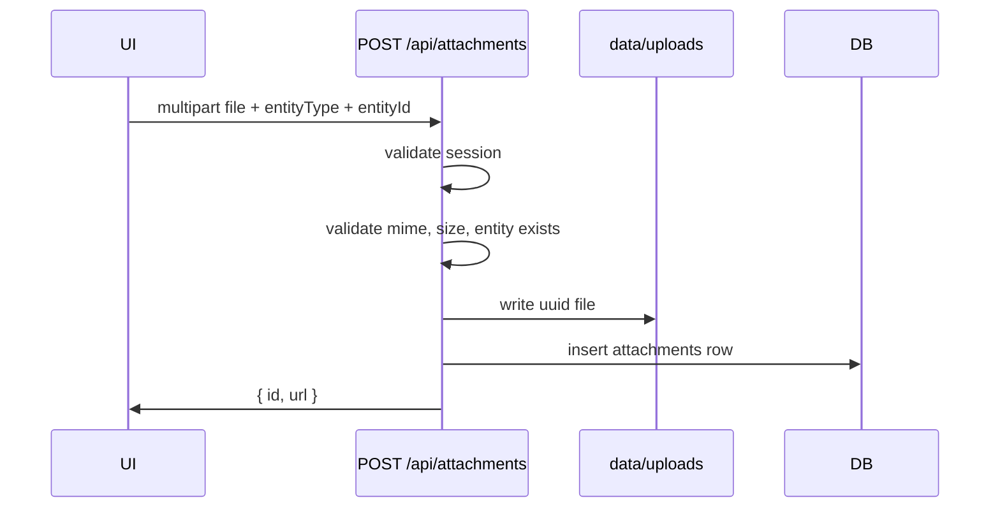

# Attachments (Photos)

Structured reference for agents and contributors. Product behavior in `00_init.md` (Attachments); schema in `03_schema.md`.

**Model:** image files on local disk; metadata in SQLite. No S3 or external hosting in v1.

---

## Storage

| Field | Value |
|-------|-------|
| **Choice** | Local filesystem under `data/uploads/` |
| **Role** | Byte storage for photos |
| **Rationale** | Matches single-instance SQLite deployment. Simple Docker volume mount. No extra service cost. |
| **Conventions** | Gitignore entire `data/` directory (already in `.gitignore`). Paths stored in DB are relative to project root: `uploads/{uuid}.{ext}`. Never serve files without auth check. |
| **References** | `09_deploy.md` for volume mounts |

Directory layout:

```
data/
  hearth.db
  uploads/
    ab12cd34-....jpg
    ef56gh78-....webp
```

---

## Allowed files

| Rule | Value |
|------|-------|
| Mime types | `image/jpeg`, `image/png`, `image/webp`, `image/gif` |
| Max size | 10 MB per file |
| Max per entity | 10 photos |
| Extensions | Derived from mime; reject mismatch |

Validate mime from magic bytes (file-type lib or manual header check), not client-provided extension alone.

---

## Upload flow



1. Client: `<input type="file" accept="image/*">` on detail/edit forms
2. `POST /api/attachments` with `FormData`: `file`, `entityType`, `entityId`
3. Server verifies user session and that entity exists
4. Write file, insert row, emit `*.updated` notification if appropriate
5. Return `{ id, url: "/api/attachments/{id}" }` for immediate preview

Server actions are awkward for large multipart — API route is intentional exception per `04_routes.md`.

---

## Serving files

`GET /api/attachments/[id]`:

1. Validate session
2. Load `attachments` row
3. Stream file from `data/{storage_path}` with correct `Content-Type`
4. `Cache-Control: private, max-age=3600`

Do not expose direct static URLs under `/public` — all access authenticated.

---

## Entity support

Attachments link polymorphically via `entity_type` + `entity_id`:

| entity_type | When attached |
|-------------|---------------|
| `stream_entry` | On create/edit stream note |
| `restaurant` | Notes, visit review |
| `project` | Description updates, progress photos |
| `tracker_entry` | Entry note (e.g. scale photo) |
| `event` | Event note |

Upload requires entity to exist first — UI flow: create entry → edit/add photos. Optional: allow pending uploads on create form after first save.

---

## Deletion

v1 behavior:

- Deleting an entity **does not** automatically delete files (orphan cleanup deferred)
- User can remove individual attachment from entity detail UI → delete row + unlink file
- Admin orphan sweep script optional later

On attachment delete: remove DB row, then `fs.unlink` storage path. Fail gracefully if file missing.

---

## Thumbnails

v1: serve original only; browser scales via CSS `object-cover` in thumbnail grid.

Later: generate `_thumb.webp` on upload with `sharp` if performance requires.

---

## Docker & backup

- Mount `data/` as a single volume (DB + uploads together) — see `09_deploy.md`
- Backup = copy `data/` directory while app stopped or via SQLite backup API

---

## Security

- Auth required for upload and download
- Reject path traversal in any user-supplied filename — store server-generated UUID names only
- Rate-limit uploads per user (simple counter) if abuse matters on shared network

---

## Testing

- Upload valid jpeg → row + file exist
- Oversize / wrong mime rejected
- GET without session → 401
- Delete removes file from disk

Use temp directory override `UPLOADS_DIR` in tests.

---

## Environment variables

```yaml
attachments:
  uploads_dir: UPLOADS_DIR  # default: data/uploads
  max_bytes: 10485760       # 10 MB
  max_per_entity: 10
  allowed_mime:
    - image/jpeg
    - image/png
    - image/webp
    - image/gif
```

---

## Attachments summary (machine-readable)

```yaml
attachments:
  storage: local_filesystem
  base_path: data/uploads
  metadata_table: attachments
  upload_route: POST /api/attachments
  serve_route: GET /api/attachments/[id]
  max_size_bytes: 10485760
  max_per_entity: 10
  mime_allowlist: [image/jpeg, image/png, image/webp, image/gif]
  thumbnails: false  # v1
```
