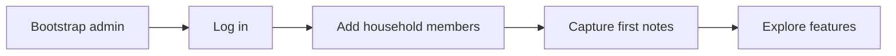

# First use guide

This guide walks through setting up hearth for your household — from the first admin account to adding members and capturing your first notes.

## Overview



One hearth instance = one household. There is no self-service signup — the admin creates accounts for everyone.

## Step 1: Bootstrap the admin account

Run once when the instance has no users.

**Local development:**

```bash
pnpm run auth:bootstrap
```

**Docker:**

```bash
docker compose exec app pnpm run auth:bootstrap
```

You'll be prompted for:

| Field | Notes |
| ----- | ----- |
| Username | Login identifier (unique within the instance) |
| Password | Minimum 8 characters |
| Display name | Optional — used for @-mentions and activity attribution |

!!! tip "Save credentials securely"
    There is no "forgot password" email flow. Store the admin password somewhere your household can access if needed.

## Step 2: Log in

1. Open your hearth URL (e.g. [http://localhost:3000](http://localhost:3000))
2. Enter your username and password
3. You'll land on the **home page** — a glanceable summary across all features

## Step 3: Add household members

Only admins can create users.

1. Click your name in the nav → **Admin** (or go to `/admin/users`)
2. Click **Create user**
3. Enter username, initial password, and optional display name
4. Share credentials with the household member out of band (text, in person, etc.)

Each new member logs in with the credentials you set. They can change their own password under **Settings**.

See [User management](../admin/users.md) for disable, reset, and promote actions.

## Step 4: Capture your first stream note

The **stream** is the catch-all layer — errands, reminders, half-formed thoughts.

1. Go to **Stream** in the nav (or `/stream`)
2. Type a note in the capture box at the top — e.g. "pick up more dog food"
3. Click **Add**

Your note appears in the chronological list. Other household members will see it on their home page and in their notification feed.

### Optional: pin or add timing

- **Pin** — surface an item on the home page for attention
- **Rough when** — freeform timing like "this week" or "before the trip" (no strict due dates)
- **@-mention** — type `@username` to nudge a specific person

## Step 5: Explore other features

| Feature | Good first action |
| ------- | ----------------- |
| Restaurants | Add a place someone mentioned: "Emily said the pasta is great" |
| Projects | Log something around the house: "fix the back gate latch" |
| Metrics | Create one metric (e.g. pet weight), add an entry, and watch the chart |
| Inventory | Add an appliance with its model and manual link |

Each feature has a dedicated page in the [User guide](../user-guide/index.md).

## Step 6: Check notifications

Open the **bell icon** in the nav to see household activity since you last visited. When someone @-mentions you, it appears prominently here.

## What everyone sees

All authenticated users share the same data. There are no private notes or per-user views of content — hearth is a shared surface by design.

| Role | Can do |
| ---- | ------ |
| **Member** | Read/write all household data, change own password |
| **Admin** | Everything above, plus create/disable users and reset passwords |

## Common first-day checklist

- [ ] Admin account bootstrapped
- [ ] All household members have accounts
- [ ] At least one stream note captured
- [ ] One restaurant or project added (optional)
- [ ] Everyone has logged in once and seen the home page
- [ ] Backup plan in place if running on a server — see [Backup & restore](../operations/backup-restore.md)

## Troubleshooting

| Problem | Solution |
| ------- | -------- |
| Bootstrap says users already exist | An admin was already created; log in or reset via CLI/DB |
| Can't reach `/admin/users` | You need the admin role; ask the instance admin |
| Login fails | Check username/password; account may be disabled |
| Blank page after login | Check browser console; restart the app (migrations run on startup) |

More help: [Troubleshooting](../operations/troubleshooting.md)
